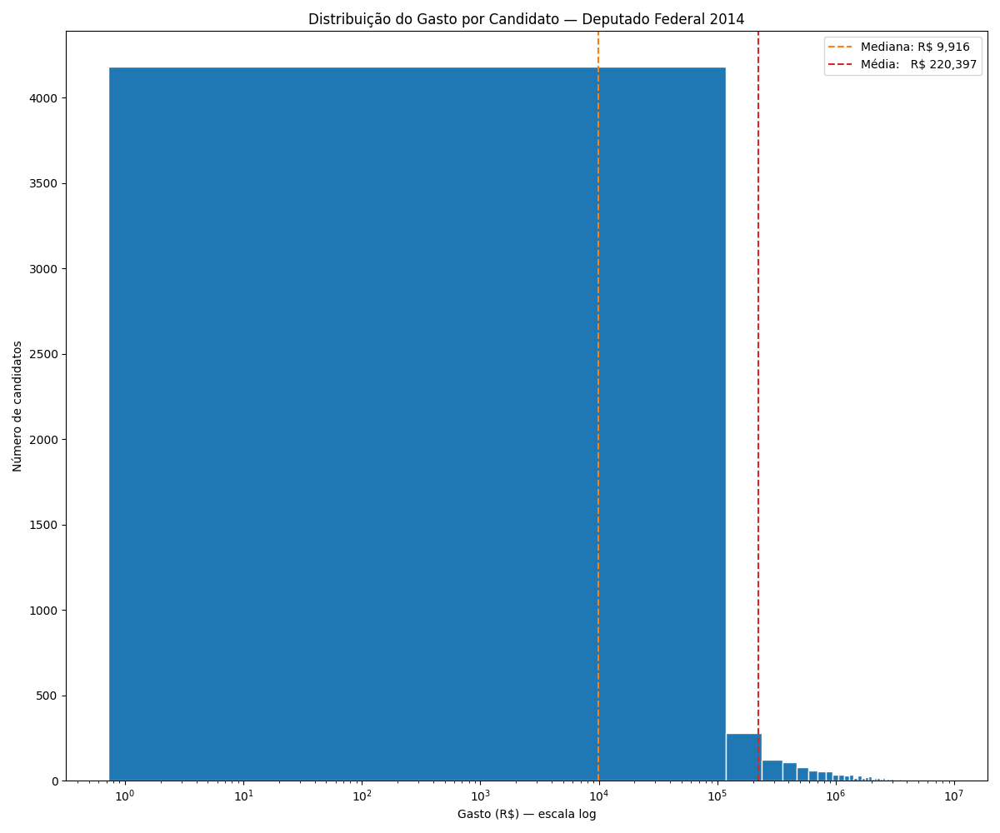
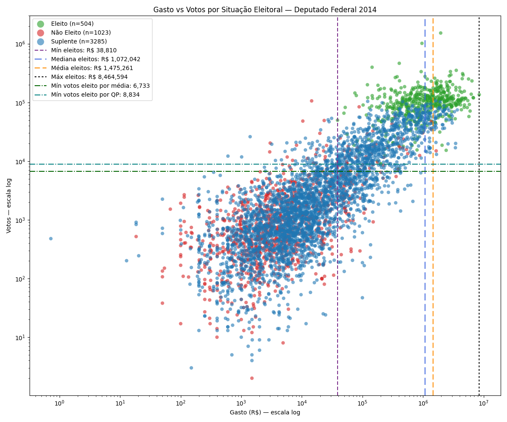
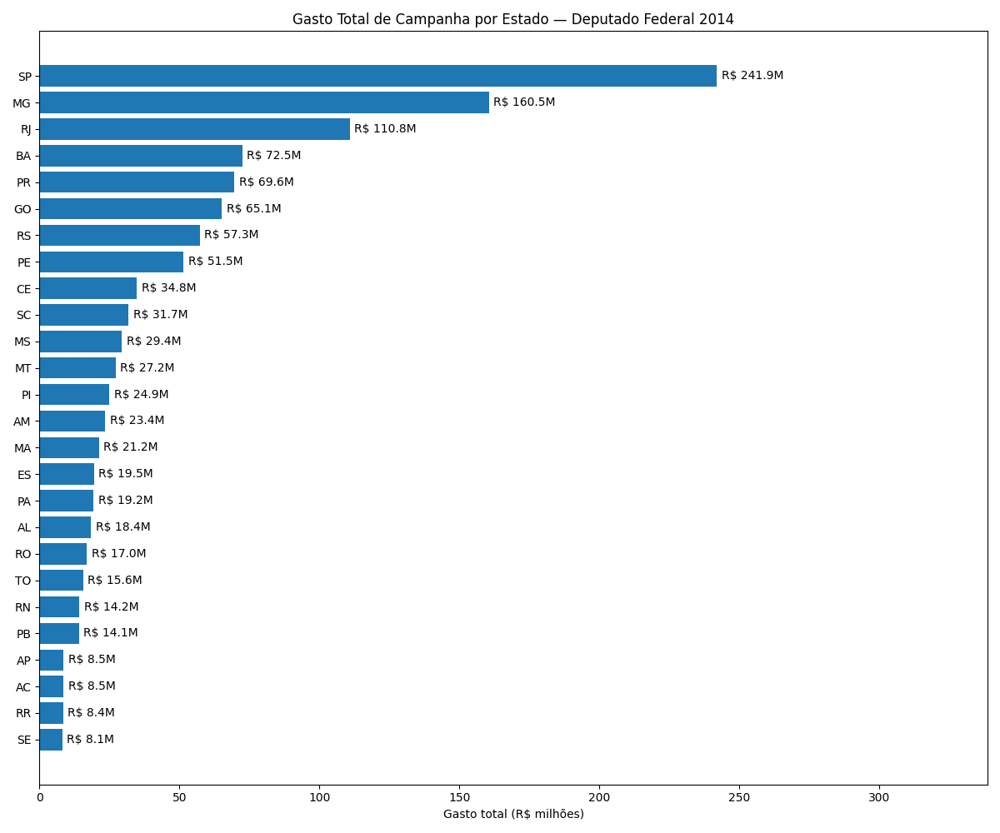
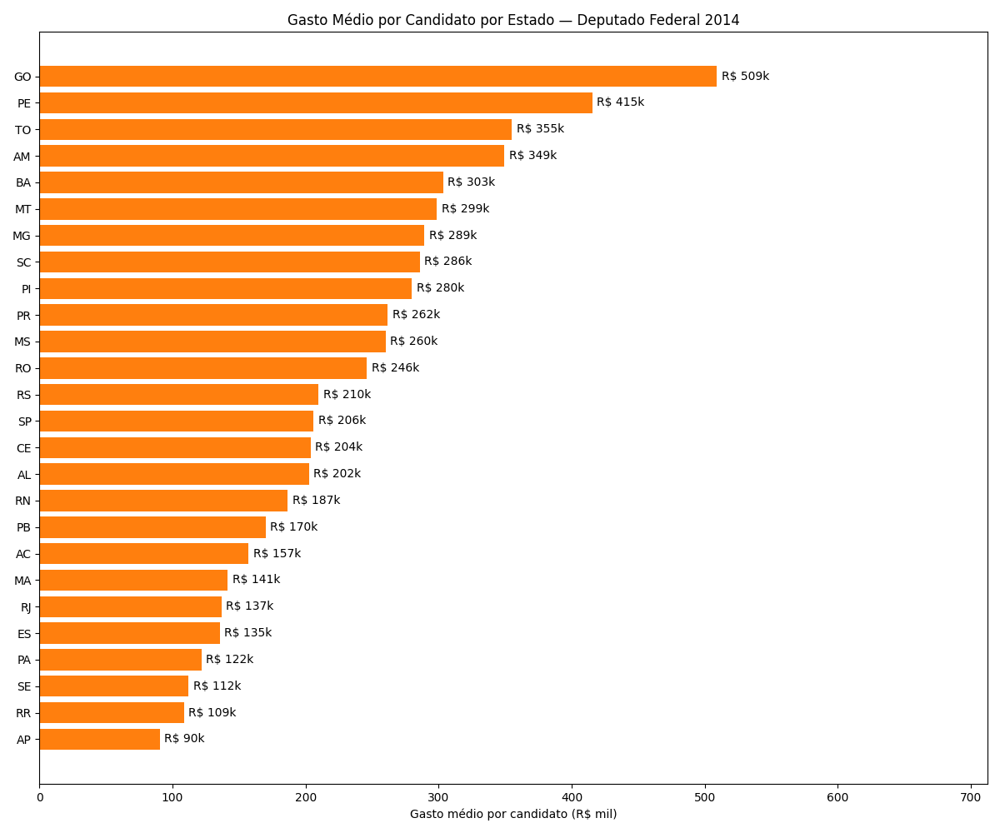
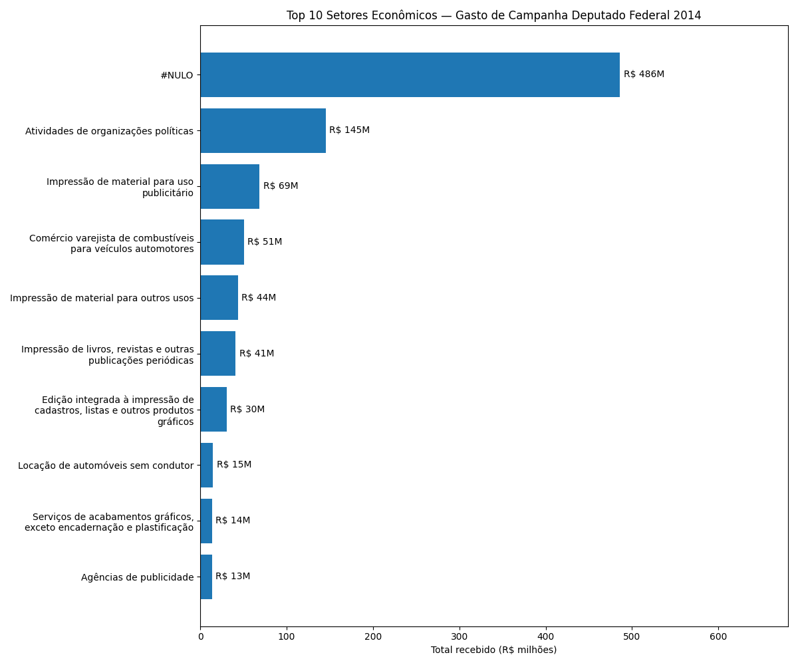
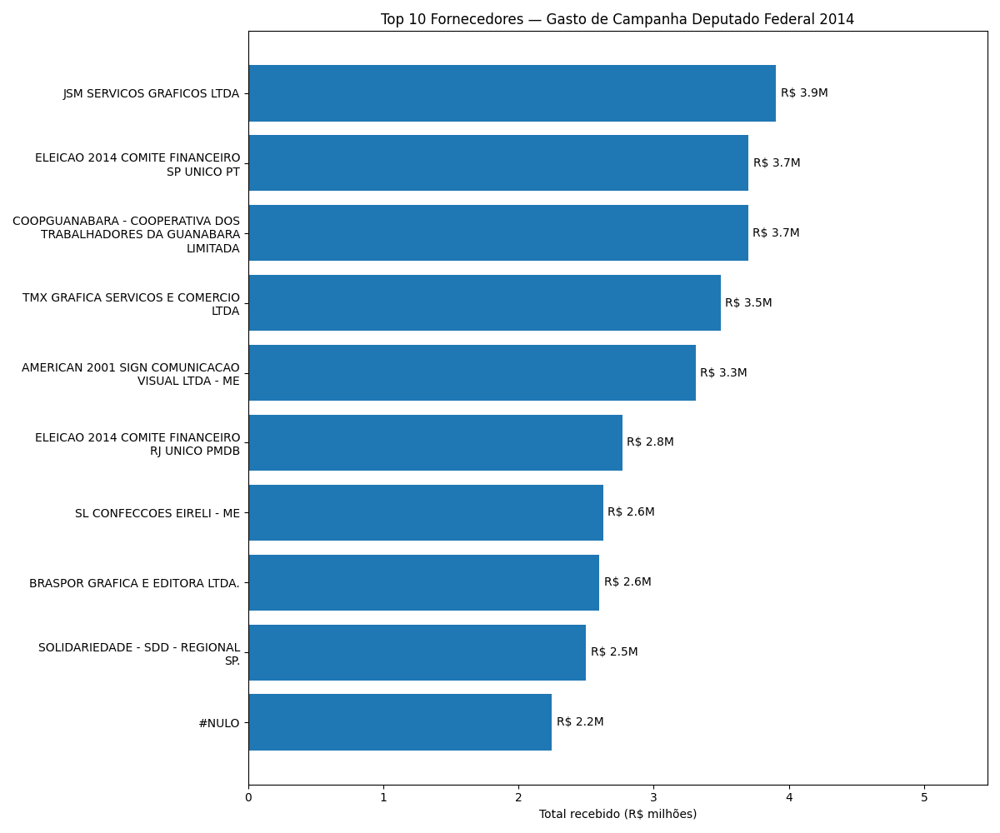

# MBA Descriptive Statistics — D1 Titanic and D2 Brazilian Federal Deputy Elections 2014

Final Project for the **Descriptive Statistics** course of the MBA in Data Science.

## Objective

Apply descriptive statistics concepts to two real-world datasets: the Titanic passenger dataset and Brazilian electoral campaign finance data. The analysis covers measures of central tendency, dispersion, and separatrices, as well as bar charts, histograms, scatter plots, Pearson correlation, and logarithmic scale.

## Presentation Format

This project will be presented to the professor in the form of a scientific article following the IEEE format. Since no specific template was required, the IEEE standard was chosen as it is a widely accepted technical and scientific format, appropriate for an MBA-level course.

---

## D1 — Titanic

### Data

| File | Source | Description |
|---|---|---|
| `datasets/titanic.csv` | Professor | Main dataset: passenger records |
| Bank of England CPI | [Bank of England](https://www.bankofengland.co.uk/monetary-policy/inflation/inflation-calculator) | Inflation index 1912 to 2016, used for fare correction |
| World Bank CPI | [World Bank](https://data.worldbank.org/indicator/FP.CPI.TOTL) | Inflation index 2016 to 2024, continuation of the BoE series |

- 887 total records, 8 original variables
- **15 records with Fare = 0 were intentionally removed**, leaving 872 passengers for analysis. These records correspond to crew members or complimentary passengers whose fare was not applicable. Keeping them would distort fare statistics (mean, median, distribution) and inflate the inflation-adjusted figures
- Key variables: Age, Fare, Sex, Pclass, Survived
- Feature engineering: fares adjusted for inflation to 2024 values using Bank of England CPI (1912 to 2016) and World Bank CPI (2016 to 2024), resulting in a correction factor of approximately 107x; age group variable created (Criança, Jovem, Adulto, Idoso)

### Notebook Structure

1. Imports and constants
2. Loading and preparation (inflation adjustment, age groups)
3. Exploratory analysis
   - 3.1 Dataset overview (describe)
   - 3.2 Variable identification
   - 3.3 Fare frequency (histogram, log scale)
   - 3.4 Age frequency (histogram with KDE curve)
   - 3.5 Qualitative variables (bar and pie charts for Sex, Pclass, Survived)
   - 3.6 Fare density by class (KDE, log scale)
   - 3.7 Survival profile by class, gender and age group
   - 3.8 Boxplot and percentiles (P10, Q1, Q2, Q3, P90)
   - 3.9 Scatter plot Age x Fare and Pearson correlation
4. Summary and conclusions
   - 4.1 Requirements checklist (PDF mapped to notebook sections)
   - 4.2 Socioeconomic profile of passengers
   - 4.3 Factors associated with survival
   - 4.4 Relationship between age and fare
   - 4.5 Final considerations

### Key Findings

- Survival was not random: women (~74% survival rate), children and first-class passengers had significantly higher survival rates, reflecting unequal access to lifeboats
- Fare distribution is strongly skewed to the right: the most expensive ticket is equivalent to approximately £55,000 (around R$400,000 in today's values), highlighting the social stratification on board
- Age distribution is approximately symmetric with median around 28 years
- Pearson correlation between age and fare is close to zero, meaning they are independent features, favorable for predictive modeling

### Visualizations

| | |
|---|---|
|  |  |
|  |  |
|  |  |
|  |  |

---

## D2 — Brazilian Elections

### Data

| File | Source | Description |
|---|---|---|
| `datasets/eleicoes.csv` | Professor | Main dataset: spending and votes per candidate |
| `datasets/extras/despesas_candidatos_2014_brasil.txt` | TSE | Declared expenses by invoice. **Excluded from git (~1GB file)** |
| `datasets/extras/consulta_cand_2014_BRASIL.csv` | TSE | Official candidate registry: electoral status, gender, party |
| `datasets/extras/eleicoes_enriquecido.csv` | Generated | Enriched dataset (one-time join, saved locally) |
| `datasets/extras/fornecedores_deputados.csv` | Generated | Suppliers dataset aggregated by candidate x supplier |

External source: [dadosabertos.tse.jus.br](https://dadosabertos.tse.jus.br), 2014 General Elections, Federal Deputy.

- 6,353 records after enrichment, one row per candidate
- **~15% of candidates with Gasto = 0 were excluded from analyses.** All elected candidates registered positive spending; keeping zero-spending candidates would distort measures of central tendency and make correlation analyses meaningless
- Key variables: Estado (UF), Numero Candidato, Gasto (campaign spending in BRL), Votos (votes received), Situacao (election result)

### Notebook Structure

1. Imports, constants and functions
   - 6 reusable functions: `plot_gasto_vs_votos`, `tabela_gasto_vs_votos`, `plot_barh`, `plot_histograma`, `calc_bins`, `plot_pearson`
2. Dataset loading and preparation
   - 2.1 Original dataset
   - 2.2 Feature engineering (enrichment, suppliers dataset)
   - 2.3 Data validation (completeness and consistency against TSE source)
3. Exploratory analysis: Brazil
   - 3.1 Dataset overview
   - 3.2 Bins calculation
   - 3.3 Spending distribution (histogram, log scale)
   - 3.4 Spending by state (total and mean)
   - 3.5 Spending by party (top 10 total and mean)
   - 3.6 Spending vs votes scatter plot and Pearson correlation
   - 3.7 Supplier analysis (by sector and top suppliers)
   - 3.8 Pearson correlation for all states (Brazil-wide table)
   - 3.9 Summary statistics table by state (mean, median, std, min, max, Q1, Q3)
4. Exploratory analysis: RJ
5. Exploratory analysis: GO
6. Exploratory analysis: AM
   - Each state section (4 to 6) follows the same structure: overview, bins, spending histogram, votes histogram, spending by party, scatter + Pearson correlation, supplier analysis
7. Summary and conclusions
   - 7.1 Requirements checklist (PDF mapped to notebook sections)
   - 7.2 Campaign spending distribution
   - 7.3 Correlation between spending and votes
   - 7.4 Regional heterogeneity
   - 7.5 Suppliers and economic sectors
   - 7.6 Final considerations

### Visualizations

| | |
|---|---|
|  |  |
|  |  |
|  |  |

### Key Findings

- Campaign spending distribution is strongly skewed to the right in all states: national median of R$ 9,916 vs mean of R$ 220,397 (22x gap); the median is a more representative measure of the typical candidate than the mean
- Pearson correlation between spending and votes is positive in all 27 states; intensity varies: AM r = 0.902 (strong), GO r = 0.605 , RJ r = 0.556
- Elected candidates spent hundreds of times more than non-elected candidates (median ratio: AM 1,200x, GO 800x, RJ 500x); spending is a frequent condition among elected candidates but not a sufficient one
- Graphic and visual communication companies dominate classified spending, reflecting the weight of printed materials in 2014 campaigns; party committees appear among the top recipients in all states, indicating centralized financial transfers via party structure
- The AM stands out for air taxi services in its top 10 suppliers, consistent with the logistical challenges of campaigning in the Amazon region

---

## Requirements

```
pandas
matplotlib
scipy
numpy
requests
openpyxl
```
